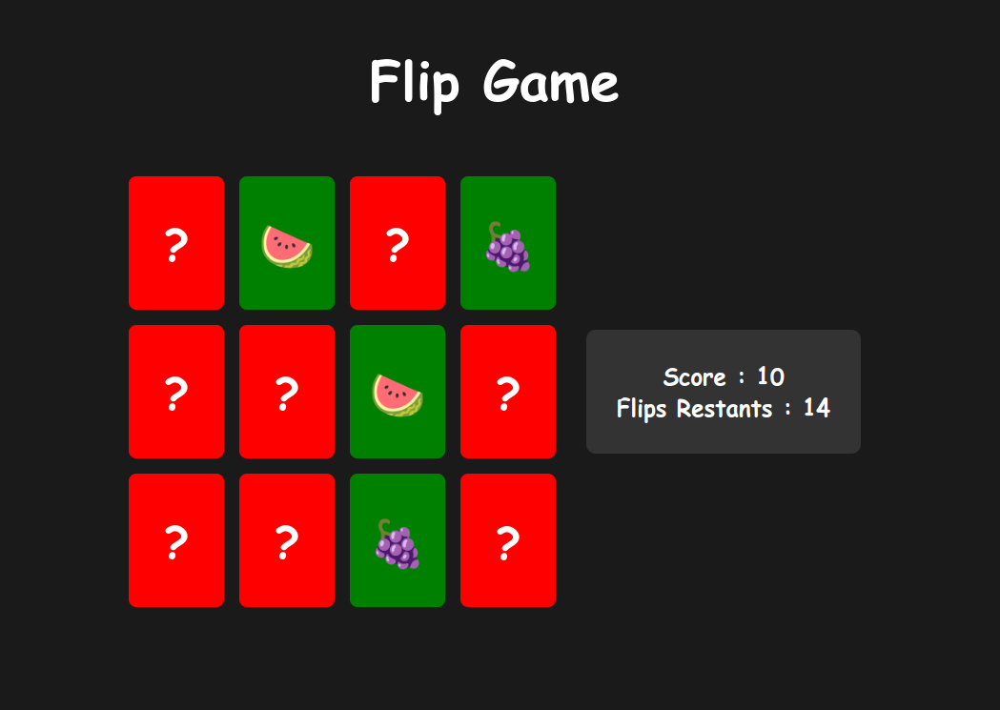

# Flip Game

I wanted to test my ability to create a game in JavaScript within 30 minutes, and I succeeded. Here is Flip Game, a memory game where the goal is to find the matching pair for each card. Below is the link to the game: https://toukoms.github.io/flip-game/

## Screenshot

